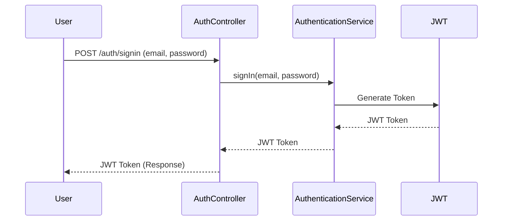

# README for Shopping Service Project

## Overview

The Shopping Service project is an educational implementation focusing on leveraging Spring Boot with Spring Security 6 and JWT-based authentication. It's designed to provide a hands-on experience in understanding the integration of REST Assured for API testing, secure handling of authentication and authorization with JWT tokens, and the overall framework functionalities of Spring Boot.

## Features

- User Authentication: Sign-up and sign-in functionalities.
- Role-Based Access: Separate endpoints for general users and admin roles.
- JWT Token Generation: Secure authentication token generation using JWT.
- RESTful API Design: Organized endpoints for easy interaction.

## Prerequisites

- JDK 21 or later
- Maven 3.2+
- Docker

## Running the Application

1. **Start the Application**:
   ```bash
   mvn spring-boot:run
   ```

2. **Access the Application**:
   The application will be available at `http://localhost:8080`.

## Testing the Application

To test the application, you can use the integrated tests written with REST Assured or perform manual testing using cURL commands.

### Using cURL for Testing

1. **Sign Up**:
   ```bash
   curl -X POST http://localhost:8080/api/auth/signup \
   -H "Content-Type: application/json" \
   -d '{"name": "John Doe", "email": "johndoe@example.com", "password": "password"}'
   ```

2. **Sign In**:
   ```bash
   curl -X POST http://localhost:8080/api/auth/signin \
   -H "Content-Type: application/json" \
   -d '{"email": "johndoe@example.com", "password": "password"}'
   ```

3. **Access User Endpoint**:
   ```bash
   curl -X GET http://localhost:8080/api/user \
   -H "Authorization: Bearer <JWT_TOKEN>"
   ```

4. **Access Admin Endpoint**:
   ```bash
   curl -X GET http://localhost:8080/api/admin \
   -H "Authorization: Bearer <JWT_TOKEN>"
   ```
   Note: Replace `<JWT_TOKEN>` with the token received from the sign-in response.

## Security Configuration

The security configuration in the application ensures:
- Stateless session management.
- Protected endpoints based on role.
- JWT token validation for each request.

## Project Structure

- **AuthController**: Manages authentication-related operations like sign-up and sign-in.
- **Security Configuration**: Configures Spring Security for JWT-based authentication.
- **Dependency Management**: Managed via Maven, as shown in the provided `pom.xml`.

## Learning Objectives

- **Spring Security 6**: Understand the advanced features and capabilities for securing applications.
- **JWT Authentication**: Learn how to implement and manage JWT-based user authentication.
- **REST Assured**: Practice writing tests for RESTful APIs using REST Assured.

## Sequence Diagram

Below is a sequence diagram illustrating the flow of a user signing in:



This README aims to provide a comprehensive guide to understand and interact with the Shopping Service project. Feel free to explore and experiment to gain a deeper insight into Spring Security, JWT, and REST Assured.